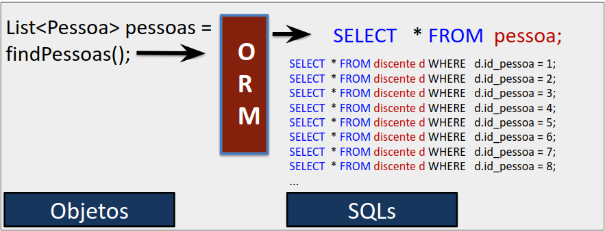

Catálogo de Code Smells ORM
===========================

A tecnologia *ORM* apresenta diversos benefícios, com abstração das comunicações
pertinentes a camada de dados e conversão entre objetos e o banco de
dados relacional, permitindo ao desenvolvedor um foco maior no
desenvolvimento das regras de negócio. Todavia essa abstração pode
trazer problemas de desempenho e manutenibilidade se as configurações,
mapeamentos e instruções ORM forem realizadas de forma inadequada. Nesta
seção, apresentamos o catálogo de *code smells* ORM em Java. A definição do que representa
um *code smell* é decorrente de uma análise subjetiva baseada na
experiência e na intuição humana. Para que uma prática seja considerada
um *code smell* considerando o domínio específico de ORM em Java, ela
deve indicar uma má escolha de implementação e sugerir sintomas que
podem ser indicativos de algo errado no código, indicando a necessidade
de refatoração. Portanto, com base nos resultados das revisões (RR e
GLR), extraímos más práticas relacionadas a ORM em Java. O catálogo possui o foco em Java devido à
linguagem possuir uma especificação padrão para ORM através da API JPA
que permite categorizar de uma mesma maneira *code smells* ORM em
diferentes *frameworks*. Foram selecionados *code smells* cujo conteúdo
possui pelo menos três citações em fontes diferentes nas revisões
realizadas, resultando em oito *code smells* ORM.

Este capítulo apresenta os *code smells* selecionados agrupados por
tipos. Os tipos foram definidos como os possíveis problemas causados
pelo conjunto de *code smells* relacionados. Para uniformização, cada
*code smell* ORM está estruturado em: *descrição do smell*, com uma
descrição resumida do *code smell* ORM bem como exemplo prático;
sugestão de refatoração, apresentando as melhores práticas encontradas
nas revisões realizadas e um exemplo prático corrigindo o apresentado na
descrição do *smell*; por fim, uma discussão e detalhamento referente ao
*code smell* em questão. A Tabela \[tab:catalogo\] apresenta os oito
*code smells* ORM selecionados para o catálogo, contendo um breve resumo
e categorizados por tipo de problema, seguidos pelas referências das
evidências do RR e GLR (Tabela \[tab:resultado\_revisao\]) a partir dos
quais os extraímos.

[ | m[0.95cm]{} | m[3.4cm]{} | m[4.2cm]{} | m[5.62cm]{} | ]{}

**Tipo** & **Code Smell ORM** & **Referências da Revisão** & **Resumo**\
& 1. Eager como estratégia de
busca nos relacionamentos a nível de classe & [\[]{}RR01[\]]{},
[\[]{}RR03[\]]{}, [\[]{}RR04[\]]{}, [\[]{}GLR02[\]]{},
[\[]{}GLR03[\]]{}, [\[]{}GLR04[\]]{}, [\[]{}GLR05[\]]{},
[\[]{}GLR07[\]]{}, [\[]{}GLR09[\]]{}, [\[]{}GLR10[\]]{},
[\[]{}GLR11[\]]{}, [\[]{}GLR12[\]]{}, [\[]{}GLR13[\]]{},
[\[]{}GLR14[\]]{}, [\[]{}GLR15[\]]{}, [\[]{}GLR16[\]]{},
[\[]{}GLR17[\]]{}, [\[]{}GLR18[\]]{}. & Atributos que representam
relacionamento mapeados com estratégia de busca Eager a nível de classe
(estático) faz o objeto relacionado sempre ser carregado pelo ORM, mesmo
quando não utilizado, sem poder alterar o comportamento a nível de
consulta (dinâmico)\

& 2. Recuperação de dados sem
projeção para somente leitura & [\[]{}RR01[\]]{},
[\[]{}GLR02[\]]{}, [\[]{}GLR03[\]]{}, [\[]{}GLR05[\]]{},
[\[]{}GLR17[\]]{}. & Não utilização de projeção ou DTOs para recuperar
somente os atributos desejados do banco de dados quando o resultado for
utilizado apenas para leitura, faz com que sejam recuperados dados em
excesso.\
& 3. Atualização desnecessária de
toda a entidade & [\[]{}RR01[\]]{}, [\[]{}RR02[\]]{},
[\[]{}RR03[\]]{}. & Qualquer alteração de atributos na classe faz com
que todas as colunas da entidade mapeada sejam atualizadas no banco de
dados, quando seria necessário atualizar apenas as colunas dos atributos
alterados.\

& 4. Falta de paginação quando
não necessário todo o resultado & [\[]{}GLR01[\]]{},
[\[]{}GLR02[\]]{}, [\[]{}GLR05[\]]{}, [\[]{}GLR13[\]]{},
[\[]{}GLR17[\]]{}. & Consultas que retornam coleção de dados sem a
utilização dos parâmetros de paginação para limitar os resultados quando
não utilizado todos os registros.\
& 5. Falta de Join Fetch:
estratégia de busca Eager & [\[]{}RR01[\]]{}, [\[]{}RR04[\]]{},
[\[]{}GLR02[\]]{}, [\[]{}GLR04[\]]{}, [\[]{}GLR05[\]]{},
[\[]{}GLR06[\]]{}, [\[]{}GLR07[\]]{}, [\[]{}GLR09[\]]{},
[\[]{}GLR10[\]]{}, [\[]{}GLR11[\]]{}, [\[]{}GLR12[\]]{},
[\[]{}GLR13[\]]{}, [\[]{}GLR14[\]]{}, [\[]{}GLR15[\]]{},
[\[]{}GLR16[\]]{}, [\[]{}GLR17[\]]{}, [\[]{}GLR18[\]]{}. & Consultas ORM
sem utilização de JOIN
FETCH para os atributos que estão mapeados como Eager a nível de classe, gerando
N consultas adicionais para carregar os objetos relacionados.

\

& 6. Acesso um por um: estrutura
de repetição e estratégia de busca Lazy & [\[]{}RR03[\]]{},
[\[]{}RR04[\]]{}, [\[]{}GLR01[\]]{}, [\[]{}GLR05[\]]{},
[\[]{}GLR08[\]]{}, [\[]{}GLR10[\]]{}, [\[]{}GLR11[\]]{},
[\[]{}GLR12[\]]{}, [\[]{}GLR13[\]]{}, [\[]{}GLR14[\]]{},
[\[]{}GLR16[\]]{}, [\[]{}GLR19[\]]{}. & Ao recuperar um atributo de um
objeto referente a uma entidade dentro de uma estrutura de repetição, se
a estratégia de busca for Lazy, consultas adicionais serão
executadas para cada iteração.\
& 7. @OneToMany unilateral com
uso inadequado de coleções & [\[]{}RR05[\]]{}, [\[]{}GLR07[\]]{},
[\[]{}GLR15[\]]{}. & `@OneToMany` unilateral com uso inadequando de
coleções Java faz com que a cada inserção/remoção de um elemento seja
modificado todos os registros da coleção no banco de dados.\

& 8. Não uso de consultas somente
leitura & [\[]{}GLR01[\]]{}, [\[]{}GLR02[\]]{},
[\[]{}GLR15[\]]{}. & Objetos recuperados da base de dados para fins
únicos de consultas sem que possuam configurações para somente leitura,
faz com que seja gerenciado pelo contexto de persistência
desnecessariamente.\

Dados em excesso {#dados_excesso}
----------------

Segundo [@mlr15_hibernate_543], trazer dados em excesso do banco de
dados para a aplicação pode ser considerado o problema de desempenho
número um na maioria das aplicações que utilizam JPA.
[@Chen:2016:Redundant:Data] relata que o fato do ORM operar em um nível
inferior (acesso a dados), não permite identificar quais dados serão
utilizados no retorno e assim não fornece uma abordagem ideal de
recuperação de dados para todos os casos, podendo gerar problemas de
desempenho ao recuperar dados em excesso do banco de dados. A Figura
\[fig:dados\_excesso\] apresenta um exemplo ao requerer apenas a
matricula do objeto `discente`, a consulta gerada pelo *framework* ORM
busca mais informações que a desejada no banco de dados. A seguir são
apresentados os *code smells* relacionados a este problema.

{width="\linewidth"}
\[fig:dados\_excesso\]

### Eager como estratégia de busca nos relacionamentos a nível de classe (estático) {#subsection:EAGER_ESTATICO}

#### Descrição do *Smell*

Utilização da estratégia de busca Eager (anotação
`FetchType.EAGER`) nos atributos que representam relacionamentos a nível
de classe, ou a falta de anotação `FetchType.LAZY` para relacionamentos
com anotação `@ManyToOne` e `@OneToOne` que por padrão utilizam a
estratégia de busca Eager,
faz com que o objeto relacionado sempre seja recuperado do banco de
dados mesmo quando não utilizado, podendo causar desperdício de
processamento computacional, problemas de desempenho e manutenção pois
não permite a alteração da estratégia de busca em nível de consulta
(dinâmico). O [Exemplo \[alg:eager\_smell\]]{} demonstra a ocorrência do
*smell* utilizando a anotação `@ManyToOne` com a estratégia de busca do
tipo Eager. O objetivo do
código é recuperar apenas a matrícula de um discente, porém recupera
também a entidade `Pessoa` sem necessidade através de JOIN.

    @Entity
    class Discente{
     @ManyToOne(fetch = FetchType.EAGER)
     private Pessoa pessoa;	
     ...
    }

    public static void main(String[] args) {
     ...
     Discente d = findDiscenteById(1);
     d.getMatricula();
    }

  **Instrução SQL gerada:**
  ---------------------------

#### Sugestão de Refatoração

A estratégia de busca definida para relacionamentos a nível de classe
deve ser do tipo Lazy,
conforme recomendações encontradas nas revisões realizadas, evitando
assim carregar o objeto relacionado para todas as regras de negócio que
utilizam o objeto da classe em questão. Com a utilização de Lazy, o ORM irá recuperar o
objeto relacionado somente quando alguma informação do mesmo for
solicitada. Se for necessário que o objeto do relacionamento seja
recuperado com o comportamento Eager para alguma regra de
negócio de forma a evitar consultas adicionais, deve ser realizado o
tratamento em nível de consulta, realizando JOIN FETCH na consulta para a
regra de negócio ou através da anotação `@NamedEntityGraph` introduzida
no JPA 2.1[^8] que permite definir um grafo de entidades a serem
recuperadas no banco de dados. O [Exemplo
\[alg:eager\_smell\_refactory\]]{} apresenta a refatoração do [Exemplo
\[alg:eager\_smell\]]{}, alterando a estratégia de busca para Lazy, evitando assim o JOIN desnecessário com a
entidade `Pessoa`.

    @Entity
    class Discente{
     @ManyToOne%*\Hig{(fetch = FetchType.LAZY)}%*
     private Pessoa pessoa;	
     ...
    }
    public static void main(String[] args) {
     ...
     Discente d = findDiscenteById(1);
     d.getMatricula();
    }

  **Instrução SQL gerada:**
  ---------------------------

#### Detalhamento e Discussão

Uma das causas de excesso de dados em *frameworks* ORM é a utilização
indevida da estratégia de busca do tipo Eager. Essa estratégia é
utilizada para carregar previamente as informações do banco de dados de
um objeto relacionado. O mapeamento na forma estática utiliza uma
anotação a nível de classe no atributo que representa outro objeto, de
forma a sempre carregar o objeto relacionado. Por exemplo: objeto A
possui um atributo relacionado ao objeto B. Utilizando Eager, sempre que qualquer
atributo do objeto A for carregado, o objeto B também será, independente
se alguma informação do objeto B será utilizada. [@bauer2005hibernate]

Segundo a documentação oficial do Hibernate, a utilização da estratégia
de busca do tipo Eager de
forma estática (definida a nível de classe) é quase sempre uma má
escolha [@mlr15_hibernate_543]. Esta estratégia é considerando um *code
smell* ORM devido aos seguintes riscos:

-   Os dados do objeto relacionado sempre serão carregados por completo,
    ainda que não sejam utilizados. Assim, poderá acarretar em um
    processamento desnecessário ao banco de dados, carregando sempre o
    objeto relacionado. O problema pode se agravar caso o objeto
    relacionado também esteja com outros objetos associados utilizando
    Eager, gerando mais
    consultas desnecessárias. [@Chen:2014:Performance:Anti-patterns];

-   Se durante uma consulta ORM não for realizado o JOIN FETCH para todas os
    relacionamentos anotados como Eager, será realizada uma
    sub-consulta para cada relacionamento, podendo gerar o problema do
    $N+1$ [@mlr15_hibernate_543].

-   Ao definir um relacionamento na classe para Eager não poderá
    sobrescrever o comportamento para Lazy em nível dinâmico
    (nível de consulta). Já o contrário (de Lazy para Eager) é possível utilizando
    JOIN FETCH na consulta
    [@mlr1_eclipslink].

[@Chen:2014:Performance:Anti-patterns] relata que após realizada a
refatoração alterando a estratégia de busca de Eager para Lazy em uma classe com 300
registros associada a outra com 10 registros, houve um aumento de 71% de
desempenho. Para um dos autores responsáveis pela documentação do
Hibernate, [@mlr2_vlad_mihalcea_2019] a estratégia de busca Eager definida de forma estática
é um *code smell*. Na maioria das vezes é utilizado pelo desenvolvedor
para simplificar o desenvolvimento, porém não são considerados os
problemas de desempenho e manutenibilidade a longo prazo.

Apesar da documentação oficial da versão 5 do Hibernate
[@mlr15_hibernate_543] e da documentação oficial do EclipseLink
[@mlr9_toplink_perfomance] recomendar a não utilização, atualmente Eager é a estratégia de busca
padrão para mapeamentos do tipo `ManyToOne` e `OneToOne` nos
*frameworks* ORM em Java. O motivo, segundo [@mlr15_hibernate_543], é a
implementação do JPA. Antes da especificação JPA, o Hibernate por
exemplo definia todos os seus mapeamentos com a estratégia de busca
Lazy por padrão. Com o
surgimento da especificação JPA 1.0, pensava-se que nem todos os
provedores que iriam implementar JPA usariam *proxies*, podendo causar
erros ao buscar uma informação de forma Lazy em uma conexão fechada,
lançando a exceção `LazyInitializationException`. Como são *frameworks*
ORM que implementam o JPA, seguem a especificação, porém recomendam em
suas documentações oficiais que os mapeamentos do tipo `ManyToOne` e
`OneToOne` devem ser explicitamente definidos como Lazy. As demais estratégias de
busca são Lazy por padrão.
[@Chen:2016:Redundant:Data] relata que relacionamentos `ManyToOne` e
`OneToOne` apesar de representar um relacionamento de associação única,
podem gerar grandes problemas de desempenho utilizando Eager quando o objeto recuperado
contém grandes dados (por exemplo, binários ou imagens) ou o objeto
recuperado também recupera de forma Eager muitos outros objetos
relacionados). O problema se agrava quando associações do tipo
`OneToMany` e `ManyToMany`, que representam coleções e por padrão são do
tipo Lazy, são definidas
explicitamente com a estratégia de busca do tipo Eager. Com essa estratégia, a
consulta pode exigir um produto cartesiano limitando a velocidade da
consulta a quantidade de registros associados, ou gerando o problema de
$N+1$ (o qual será visto na próxima seção) com $N$ consultas adicionais
[@high_perform_vlad].

Com base no exposto, consideramos um *code smell* a utilização da
estratégia de busca Eager
a nível de classe (forma estática). Seu uso pode não gerar problemas
caso a classe sempre necessite do objeto relacionado e este possua dados
pequenos na base de dados. Mesmo nestes casos, é considerado um *code
smell* pois é complexo ter certeza no momento do desenvolvimento que
todos os casos de usos futuros precisarão do objeto do relacionamento e
que a base de dados se manterá da mesma forma, sendo recomendado
utilizar Lazy a nível de
classe e utilizar o comportamento Eager a nível de consulta
através de Join Fetch para
os que necessitarem. Fazendo uma relação com o apresentado na Seção
\[sec:bad\_smells\] é possível concluir que é uma indicação de
refatoração, uma má escolha de implementação e indica possíveis
problemas futuros relativos a desempenho e manutenibilidade. Portanto,
qualquer atributo em uma classe que representa uma associação entre
entidades contendo qualquer anotação de relacionamento (`@ManyToMany`,
`@OneToMany`, `@ManytoOne`, `@OneToOne`) com o `FetchType.EAGER`
definido, ou, em específico para relacionamentos ManyToOne e OneToOne que não estejam
explicitamente com `FetchType.LAZY` anotados, são considerados *code
smells* para o contexto deste trabalho. Os casos dos relacionamentos
ManyToMany e OneToMany são considerados como
mais graves, devido ao *Many* (Muitos) ao fim do relacionamento, o que
faz com que a consulta de um objeto apenas, trará sempre $N$ outros
objetos do relacionamento.

### Recuperação de dados sem projeção para somente leitura {#sec:projecao}

#### Descrição do *Smell*

Utilizar consultas ORM sem a utilização de projeção quando a finalidade
for somente leitura (quando nenhum gerenciamento do contexto de
persistência é necessário) pode ocasionar problemas de desempenho,
especialmente ao recuperar informações grandes como colunas do tipo
BLOB ou junções com outras
entidades de forma desnecessária, gerando incompatibilidade entre dados
necessários e dados recuperados. O [Exemplo \[alg:projecao\_smell\]]{}
demonstra a ocorrência do *smell*, onde o HQL utilizado recupera todas
as colunas da entidade `Discente`, incluindo dados grandes (coluna
`arquivo`), sendo apenas a informação da matrícula necessária para o
caso de uso.

    public Discente findDiscenteById(Integer id){
     String hql = "FROM Discente d WHERE id = :id";
     Query q = entityManager.createQuery(hql.toString());
     q.setInteger("id", id);
     return (Discente) q.uniqueResult();
    }

    public static void main(String[] args) {
     ...
     Discente d = findDiscenteById(1);
     d.getMatricula();
    }

  **Instrução SQL gerada:**
  ---------------------------

#### Sugestão de Refatoração

Para evitar trazer todos os dados da entidade, a recomendação é utilizar
projeção nas consultas. Uma das formas de realizar projeção em consultas
ORM é utilizar o operador `NEW`. Esse operador permite declarar apenas
as colunas ou atributos que são necessários carregar do banco de dados
através do construtor da classe consultada ou de um . O [Exemplo
\[alg:projecao\_smell\_refactory\]]{} demonstra um ajuste no [Exemplo
\[alg:projecao\_smell\]]{} utilizando o operador `NEW` para trazer o
próprio objeto apenas com a informação necessária para o caso de uso.

    public Discente findDiscenteById(Integer id){
     ...
     hql.append(%*\Hig{"SELECT new Discente(matricula) "}%*)
     hpl.append("FROM Discente WHERE id = :id");
     Query q = entityManager.createQuery(hql.toString());
     q.setInteger("id", id);
     return (Discente) q.uniqueResult();
    }

    public static void main(String[] args) {
     ...
     Discente d = findDiscenteById(1);
     d.getMatricula();
    }

  **Instrução SQL gerada:**
  ---------------------------

#### Detalhamento e Discussão

Realizar consultas sem projeção pode ocasionar problemas de desempenho e
manutenção, trazendo mais informação do que necessário. Quando realizada
uma consulta sem projeção, o *framework* ORM não sabe quais dados serão
necessários posteriormente, trazendo todas as colunas da entidade e seus
relacionamentos (dependendo da estratégia de busca). Essa prática pode
recuperar colunas que contenham informações grandes do banco de dados
(como uma imagem), ou muitos relacionamentos gerando um processamento
desnecessário pelo banco e pela aplicação [@Chen:2016:Redundant:Data].
Se for necessário atualizar os dados posterior a recuperação, é
importante buscar a entidade completa para ser gerenciada pelo
*framework* ORM, isso devido ao chamado *mecanismo de verificação suja*,
conforme discutido na Seção \[jpa-secao\] [@mlr15_hibernate_543].

No entendimento de [@mlr15_hibernate_543], se o objetivo for recuperar
informações somente leitura, é recomendável utilizar manipulando somente
os atributos desejados para o caso de uso. Essa estratégia traz alguns
benefícios, como reduzir a carga no contexto de persistência em execução
devido a projeções realizadas em s não precisarem ser gerenciadas pelo
*framework* ORM, além de evitar que atributos que estejam mapeados com a
estratégia de busca Eager
na entidade sejam carregados.

Analisando o exposto até então, poderia-se sugerir como recomendação de
refatoração o uso de s. Todavia, o uso do padrão para este contexto não
é um consenso. Apesar das vantagens dessa abordagem, para
[@bauer2005hibernate] utilizar s com objetivo de recuperar informação do
banco de dados ao invés da própria entidade poderia causar outras
situações indesejadas. Segundo o autor, o uso do padrão , neste
contexto, poderia adicionar dois *code smells* elencados por
[@Martinfowler2018refactoring]:

-   *Shotgun change smell*: Uma pequena alteração em alguma parte do
    código requer alterações em várias classes. No caso do , se a classe
    da entidade for alterada, os s que utilizam atributos daquela
    entidade também deverão ser alterados.

-   *Parallel class hierarchies*: Duas hierarquias de classes distintas
    contêm classes semelhantes em uma correspondência de um para um.
    Nesse caso, fica evidente a hierarquia de classes paralelas.
    Utilizando , teríamos por exemplo: `Usuario` e `UsuarioDTO`,
    `Discente` e `DiscenteDTO`.

Entretanto, ao analisar apenas o aspecto de desempenho, o pode
apresentar uma superioridade por não ser gerenciado pelo contexto do
JPA. Segundo [@thorbenJanssen], o fato das entidades serem gerenciadas
pelo JPA faz com que sejam armazenadas no cache de primeiro nível. Isso
evita instruções repetidas e otimiza gravações no banco de dados. Porém,
o gerenciamento de cache de primeiro nível leva tempo e pode ser um
problema se executadas grandes quantidades de consultas em entidades.

A Figura \[fig:entitiesXdto\] apresenta o comparativo de tempo na
execução de instruções utilizando entidade *versus* .

Perante o exposto, podemos catalogar como *code smells* consultas ORM
que não utilizam projeção e são utilizadas somente para consulta, pois
podem gerar problemas futuros de desempenho e manutenibilidade pelo
excesso de colunas desnecessárias. Consideramos como *code smell* apenas
consultas ORM declaradas, pois consultas usando o `find` do
`EntityManager` ou geradas automaticamente a partir do nome do método
são muito comuns e geralmente menos problemáticas por utilizar apenas
uma entidade. No caso de um objeto de retorno ser atualizável, também
não deve ser considerado como *code smell*. Como recomendação, podemos
citar a utilização de projeções utilizando a própria classe da entidade
ou s, deixando o desenvolvedor escolher a melhor estratégia para cada
contexto.

### Atualização desnecessária de toda a entidade

#### Descrição do *Smell*

Atualização de todas as colunas de uma entidade, quando somente um
atributo do objeto é atualizado, acarreta em atualização de dados em
excesso e pode gerar problemas de desempenho, especialmente quando a
entidade possui índices não clusterizados, dados grandes binários ou um
grande número de colunas. O [Exemplo \[alg:update\_smell\]]{} demonstra
o *smell* no qual é desejado atualizar apenas o campo `observação` da
entidade `Discente`, mas a instrução `Update` gerada pelo ORM atualiza
todas as colunas da entidade, incluindo índices e tipo BLOB.

    @Entity
    class Discente{
    ... 
     @Column
     @Index
     private Long matricula;
    	
     @Column
     private UploadedFile arquivo;
     ...
    }

    public static void main(String[] args) {
     ...
     Discente d = findDiscenteById(1);
     d.setObservacao("Discente com pendencias");
     entityManager.persist(d);
    }
        

  **Instrução SQL gerada:**
  ---------------------------

#### Sugestão de Refatoração

Sugere-se utilizar parametrizações nos *frameworks* ORM para que
realizem atualização apenas das alterações realizadas. No *Hibernate*
por exemplo é possível utilizar a anotação `@DynamicUpdate` ou realizar
instruções ORM (HQL/JPQL ou Criteria) para atualizar somente as colunas
desejadas. Alguns *frameworks* como o EclipseLink apresentam esta
parametrização por padrão. O [Exemplo
\[alg:update\_smell\_refactory\]]{} apresenta a utilização da anotação
`@DynamicUpdate` fazendo com que seja atualizado apenas o atributo
`observacao` na instrução `Update` gerada pelo ORM.

    @Entity
    %*\Hig{@DynamicUpdate}%*
    class Discente{
    ... 
     @Column
     @Index
     private Long matricula;

     @Column
     private UploadedFile arquivo;
     ...
    }

    public static void main(String[] args) {
     ...
     Discente d = findDiscenteById(1);
     d.setObservacao("Discente com pendencias");
     entityManager.persist(d);
    }

  **Instrução SQL gerada:**
  ---------------------------

#### Detalhamento e Discussão

Com relação a atualização de todos os campos da entidade, existe uma
distinção dependendo do *framework* ORM utilizado. Utilizando o
Hibernate, é atualizado o objeto inteiro por padrão, mesmo que a
atualização seja realizada apenas em um atributo. Isso ocasiona
processamento desnecessário ao banco de dados, principalmente em
entidades fortemente indexadas e com grande número de colunas
[@Chen:2016:Redundant:Data]. O mesmo não se aplica ao padrão do
EclipseLink, que realiza a atualização somente dos campos modificados.
No EclipseLink a atualização de todos os campos somente será realizada
de forma explicita pelo programador através de SQL ou JPQL
[@eclipselinkmigration]. Porém, para [@mlr15_hibernate_543], o fato do
Hibernate realizar a atualização com todos os atributos possui algumas
vantagens:

-   Permite que sejam utilizados recursos de cache;

-   Permite a atualização em lotes, mesmo se várias entidades
    modificarem propriedades diferentes.

Mesmo com estes fatores, quando a entidade possui índices não
clusterizados, os quais o banco de dados poderá atualizá-los de forma
redundante, recomenda-se não atualizar todos os campos
[@Chen_Emparical_Study]. Para isso, o Hibernate disponibiliza uma
anotação a nível de classe chamada `@DynamicUpdate`. Esta anotação faz
com que sempre seja atualizado apenas o campo alterado na entidade
representada pela classe [@mlr15_hibernate_543].

Com base no exposto, podemos considerar *code smell* quando possuir as
seguintes premissas: o *framework* ORM em uso utiliza a atualização de
toda entidade por padrão; a classe da entidade não possuir configuração
para atualização apenas dos atributos alterados, como `@DynamicUpdate`
do Hibernate; possuir índices não clusterizados relacionados a entidade.
Nesse caso, conforme exposto na introdução deste capítulo referente a
definição de um *code smell* ORM, indica uma necessidade de refatoração
sendo uma prática não recomendada.

### Falta de paginação quando não necessário todo o resultado

#### Descrição do *Smell*

Recuperar entidades completas do banco de dados sem especificar
parâmetros de paginação quando os registros não são totalmente
utilizados, implica em recuperação de dados em excesso causando uma
sobrecarga desnecessária, além de utilizar um alto consumo de memória
para armazenar a informação recuperada gerando problemas de desempenho.
O [Exemplo \[alg:paginacao\_smell\]]{} apresenta a ocorrência do *Smell*
recuperando todos os registros da entidade `Discente` que entraram no
ano de 2020, mas utilizando efetivamente apenas 10 registros que foram
solicitados pela camada de visão, supondo que o método
`discentesPeriodo` foi chamado com este propósito.

    public List<Discente> findByYear(int year){
     String hql = "FROM Discente d WHERE ano = :ano";
     Query q = entityManager.createQuery(hql.toString());
     ...
    }

     public List<Discente> discentesPeriodo(int year,int page,int limit) {
     int fromIndex = (page - 1) * limit;
     List<Discente> discentes = findDiscenteByYear(year);
     return discentes.subList(fromIndex, Math.min(fromIndex + limit, discentes.size()));    
    }

  **Instrução SQL gerada:**
  ---------------------------

#### Sugestão de Refatoração

A especificação JPA disponibiliza os seguintes métodos:
`setFirstResult(int)` e `setMaxResults(int)` fornecidos pelas interfaces
`Query` ou `TypedQuery` provendo recursos de paginação que podem ser
utilizados ao realizar uma consulta ORM. Desta forma é possível realizar
uma limitação nos resultados que solicitam uma coleção de dados. O
[Exemplo \[alg:paginacao\_smell\_refactory\]]{} apresenta refatoração do
[Exemplo \[alg:paginacao\_smell\]]{} utilizando uma consulta paginada
para gerar a instrução SQL com limites para o resultado, recuperando
apenas os 10 registros da entidade `Discente` solicitados pela camada de
visão, evitando problemas de desempenho com o crescimento dos dados.

    public List<Discente> findByYear(int year, int fromIndex, int limit){
     String hql = "FROM Discente d WHERE ano = :ano";
     Query q = entityManager.createQuery(hql.toString());
     %*\Hig{q.setFirstResult(fromIndex);}%*
     %*\Hig{q.setMaxResults(limit);}%*
     ....
    }

    public List<Discente> discentePeriodo(int year,int page,int limit) {
     int fromIndex = (page - 1) * limit;
     return List<Discente> discentes = findDiscenteByYear(year,fromIndex,limit);
    }

  **Instrução SQL gerada:**
  ---------------------------

#### Detalhamento e Discussão

Segundo [@mlr2_vlad_mihalcea_2019] para obter o melhor resultado nas
instruções SQL geradas pelo ORM, é importante não apenas considerar o
número de colunas, consultas e junções realizados, mas também o número
de registros que esta sendo recuperado do banco de dados. Para recuperar
apenas um conjunto específico de dados, é possível configurar elementos
como a paginação especificando um limite para quantidade de registros na
execução de uma consulta [@mlr1_eclipslink] através dos seguintes
métodos disponibilizados pela especificação JPA
[@mlr5_perform_improvment]:

-   `setFirstResult(int)`: Parâmetro utilizado para especificar o
    deslocamento;

-   `setMaxResults(int)`: Parâmetro utilizado para especificar o limite.

Na camada de visualização, as informações geralmente são apresentadas ao
usuário em um formulário paginado, apresentando uma relação natural com
a parametrização referente a paginação de dados ORM
[@mlr13_JPA_otimizando]. Exemplo: Uma entidade possui 1.000.000
registros. Em uma pagina web é apresentado um subconjunto de informações
exibindo 100 registros. Portanto os parâmetros `setFirstResult(1)` e
`setMaxResults(100)` devem ser utilizados para recuperar apenas os
registros utilizados. Outro agravante em não utilizar a paginação, é que
os dados tendem a crescer com o tempo [@mlr2_vlad_mihalcea_2019]. Em um
primeiro momento pode não apresentar problemas de desempenho mas com o
aumento de dados pode se tornar um grande problema. Também dificulta a
manutenção do código, pois o ajuste implica em alterações na estrutura
dos métodos conforme [Exemplo \[alg:paginacao\_smell\_refactory\]]{}.

Com base no exposto, podemos considerar um *code smell* ORM a não
utilização de paginação em coleções de dados quando os registros
recuperados não serão integralmente utilizados, sendo uma má escolha de
implementação, cabível de refatoração por indicar possíveis problemas
futuros relativos a desempenho com o crescimento da quantidade de
registros.

Problema do N+1 {#n1}
---------------

Os *frameworks* ORM abstraem o SQL e o mapeamento manual dos objetos,
simplificando o desenvolvimento especialmente em operações de criação,
consulta, atualização e destruição (CRUD). Mas isso tem um preço, e
conforme a estratégia de busca adotada em cada situação, o *framework*
ORM pode precisar realizar mais consultas a partir de uma consulta para
completar a informação de seus relacionamentos e montar o objeto
desejado e seus relacionamentos. Essa ação pode causar um problema de
desempenho dependendo da quantidade de consultas que são realizadas para
completar a operação [@vlad_mihalcea_n1]. Esse problema é conhecido como
$N+1$, quando a partir de uma instrução ORM são geradas N outras, sendo apresentado no
Capítulo \[chap:intro\] como exemplo motivacional desta pequisa. A
Figura \[fig:n1-representacao\] apresenta um exemplo no qual ao
solicitar uma lista do objeto `Pessoa`, a partir da consulta principal
(`select * from pessoa`) são geradas N outras consultas para obter o
relacionamento com a entidade `discente`.

{width="\linewidth"}
\[fig:n1-representacao\]

Através da análise do código, podemos detectar *code smells* que podem
gerar o problema de $N+1$, os quais são descritos a seguir.

### Falta de JOIN FETCH nas consultas de atributos do tipo Eager {#sec:falta_join_fetch}

#### Descrição do *Smell*

Consultas ORM utilizando objetos que contenham atributos de
relacionamento com a estratégia de busca do tipo Eager e sem realizar o JOIN FETCH para o objeto
relacionado, faz com que o *framework* ORM realize $N$ consultas até que
todos os objetos associados aos atributos do tipo Eager fiquem com os dados
completos gerando o problema do $N+1$. O [Exemplo
\[alg:join\_fetch\_smell\]]{} apresenta um código no qual uma consulta
para retornar uma lista da entidade `Discente` apresenta $N$ consultas
adicionais para entidade `Pessoa` realizadas pelo ORM para preencher as
informações do objeto `Pessoa` que esta com relacionamento Eager.

    @Entity
    class Discente{
     ...
     @ManyToOne(fetch = FetchType.EAGER)
     private Pessoa pessoa;	
     ...
    }
    public List<Discente> findDiscentesByYear(int year){
     String hql = "FROM Discente d WHERE d.ano = :ano";
     Query q = entityManager.createQuery(hql.toString());
     q.setInteger("ano", year);
     return (List<Discente>) q.getResultList();
    }

    public static void main(String[] args) {
     List<Discente> d = findDiscenteByYear(2020);
     ...
    }

  **Instrução SQL gerada:**
  ---------------------------

#### Sugestão de Refatoração {#subsection:refat}

Para corrigir, uma das formas possíveis seria alterar o mapeamento para
Lazy. Porém, se não for
possível alterar o tipo de estratégia na classe devido a dependências,
uma possibilidade de refatoração para evitar o $N+1$ seria realizar
JOIN FETCH para todos os
atributos Eager na
consulta ORM. Desta forma o *framework* ORM fará junções para trazer as
informações dos relacionamentos em uma única consulta em vez de gerar
$N$ consultas extras. O [Exemplo
\[alg:join\_fetch\_smell\_refactory\]]{} apresenta a correção para o
problema de N+1 gerado pelo [Exemplo \[alg:join\_fetch\_smell\]]{}
adicionando JOIN FETCH
para recuperar em forma de junção a entidade `Pessoa`.

    @Entity
    class Discente{
     ...
     @ManyToOne(fetch = FetchType.EAGER)
     private Pessoa pessoa;	
     ...
    }
    public List<Discente> findDiscentesByYear(int year){
     ...
     hql.append("FROM Discente d ");
     hql.append("%*\Hig{JOIN FETCH d.pessoa}%* p WHERE d.ano = :ano");
     Query q = entityManager.createQuery(hql.toString());
     q.setInteger("ano", year);
     return (List<Discente>)  q.getResultList();
    }

    public static void main(String[] args) {
     List<Discente> d = findDiscenteByYear(2020);
     ...
    }

  **Instrução SQL gerada:**
  ---------------------------

#### Detalhamento e Discussão

Utilizar EAGER como estratégia de busca para relacionamentos é um *code
smell* como visto na Seção \[subsection:EAGER\_ESTATICO\], portanto a
melhor abordagem é evitar o uso de Eager como estratégia de busca a
nível de classe. Porém para casos onde se deseja realizar consultas ORM
e seja complexo a refatoração no código ao alterar a estratégia de busca
(de Eager para Lazy) na classe devido a
dependências, é necessário utilizar a cláusula JOIN FETCH para todos os
atributos do EAGER para evitar o problema N + 1
[@mlr2_vlad_mihalcea_2019]. O problema de dependência mencionado ocorre
quando o código existente espera que o objeto relacionado já esteja
carregado. A alteração para Lazy pode causar exceções, como
`LAZYInitializationException` no caso do Hibernate
[@mlr15_hibernate_543]. Existem opções boas e ruins de tratar essa
exceção. Utilizar o padrão *Open Session in View* ou ativar a opção
`hibernate.enable_lazy_load_no_trans` são consideradas anti-padrões e
portanto opções ruins para evitar a exceção
[@vlad_mihalcea_lazyInitialization]. Esses são considerados anti-padrões
pois tratam apenas os sintomas e não resolvem a causa real do problema
 [@vlad_mihalcea_enable_lazy_load]. A melhor opção, nesse caso, é buscar
todos os relacionamentos necessários antes de fechar o contexto de
persistência por meio da cláusula JOIN FETCH
[@mlr15_hibernate_543]. Por esse motivo, para evitar o $N+1$, a solução
recomendada quando não possível realizar a refatoração de Eager para Lazy é utilizar JOIN FETCH nas consultas ORM
conforme recomendado na Seção \[subsection:refat\].

Com relação a refatoração apresentada utilizando JOIN FETCH é necessário um
cuidado e testes após alteração, pois dependendo do contexto o número de
junções também pode afetar o desempenho [@bauer2016java], cabendo uma
análise do desenvolvedor para avaliar qual a melhor opção. Existem
diferenças entre realizar um JOIN comum e um JOIN FETCH. Segundo
[@mlr3_tips_to_boost] a palavra FETCH da instrução JOIN FETCH é específica da JPA.
Ela informa ao provedor de persistência para inicializar também a
associação no objeto recuperado e não somente realizar a junção entre as
duas entidades. Para exemplificar de forma prática o exposto até o
momento, no capítulo \[chap:intro\] utilizamos como motivação desta
pesquisa um problema ocasionado pelo HQL do [Exemplo \[alg:java\]]{}, e
pelo mapeamento realizado no [Exemplo \[alg:sig\_eager\]]{}, que gerava
o problema $N+1$ no sistema do . Foram realizadas duas refatorações que
são detalhadas nesta seção utilizando as formas descritas no parágrafo
anterior:

-   Refatoração 1 - Ajuste das $N$ consultas na entidade `Pessoa`: Uma
    das soluções possíveis seria alterar as estratégias de busca do tipo
    Eager para Lazy em ambos os casos do
    [Exemplo \[alg:sig\_eager\]]{}, de forma que o ORM buscasse as
    informações somente quando solicitadas. Seria a melhor estratégia na
    fase de concepção do sistema, pois atualmente existem centenas de
    casos de uso que utilizam a entidade `DiscenteGraduacao`, dos quais
    muitos deles esperam que a informação de *Discente* e *Pessoa* já
    estejam carregadas. Para modificar a estratégia de busca seria
    necessária uma grande refatoração em todos os pontos do código que
    as utilizam, tendo em vista que uma chamada ao atributo
    (`discenteGraduacao.getDiscente().getPessoa()`) em um momento que a
    sessão que carregou o objeto estiver fechada, iria gerar a exceção
    `LazyInitializationException`. Isso também evidencia o problema de
    manutenção causado pelo *smell*. Com base nesses fatores, optou-se
    por adicionar *JOIN FECTH* na consulta , para continuar recuperando
    a informação de `Pessoa` mas evitando $N$ consultas extras,
    utilizando *JOIN* para trazer as informações da entidade `Pessoa` já
    na consulta principal. Após esta refatoração, a quantidade de
    consultas adicionais diminuiu de 6767 para 116.

    ![[]{data-label="fig:fetch"}](figures/fetch.png){width="\linewidth"}

-   Refatoração 2 - Ajuste da estratégia de busca: Observou-se que as
    116 consultas adicionais que restaram eram referentes a atributos
    Eager de
    `DiscenteGraduacao` referentes as entidades relacionadas `Polo`,
    `TipoCotaDiscente` e `TipoCancelamento`. Observado no código que não
    possuíam muitos casos de usos que aguardavam essas informações de
    forma Eager, sendo
    possível realizar a alteração para Lazy ajustando alguns poucos
    casos de usos. Após essa nova refatoração (Figura \[fig:eager\]), o
    tempo de execução da consulta diminuiu de 14 segundos para 11
    segundos em média e a quantidade de consultas adiciona diminuiu de
    116 para 0.

    ![[]{data-label="fig:eager"}](figures/eager.png){width="\linewidth"}

Conforme as situações expostas, consultas ORM utilizando entidades que
contenham atributos com a estratégia de busca do tipo Eager e sem realizar o JOIN FETCH para a entidade
relacionada, poderão causar $N+1$, sendo uma prática não recomendada que
indica necessidade de refatoração com potencial para gerar problemas de
desempenho e manutenibilidade, podendo ser catalogado como um *code
smell ORM*.

### Acesso um por um: estrutura de repetição e estratégia de busca do tipo Lazy {#sec:discussao_onebyone}

#### Descrição do *Smell*

Quando necessário capturar determinado atributo em uma estrutura de
coleção de objetos utilizando alguma estrutura de repetição, cujo
atributo está com a estratégia de busca do tipo Lazy, em cada passagem pela
estrutura de repetição serão geradas consultas adicionais. Essa questão
é melhor visualizada a partir do [Exemplo \[alg:n1\_lazy\_smell\]]{} que
demonstra uma consulta para recuperação de uma lista do objeto `Pessoa`
e ao acessar o atributo `discentes` em uma estrutura de repetição, são
geradas consultas extras para carregar o relacionamento Lazy.

    @Entity
    class Pessoa{
     ...
     @OneToMany(fetch = FetchType.LAZY)
     private List <Discente> discentes;	
     ...
    }

    public List<Pessoa> findAll(){
     String hql = "FROM Pessoa pes";
     ...
    }

    public static void main(String[] args) {
     List<Pessoa> pessoas = findAll();
     for (Pessoa pessoa : pessoas){
      assertNotNull(pessoa.getDiscentes());
     }
    }

  **Instrução SQL gerada:**
  ---------------------------

#### Sugestão de Refatoração {#refatoracao_lazy}

Abaixo listamos duas soluções possíveis para evitar $N+1$ neste caso:

-   `@BatchSize(N)`: utilizar a anotação `@BatchSize` sobre o atributo
    do tipo Lazy. Dessa
    forma em vez de gerar $N$ consultas, o *framework* ORM utilizará o
    operador `IN` do SQL. Poderá ser definido o número de elementos como
    parâmetro, definindo o tamanho para o carregamento em lote de
    coleções ou entidades. O [Exemplo
    \[alg:n1\_lazy\_smell\_refactory2\]]{} apresenta a refatoração do
    [Exemplo \[alg:n1\_lazy\_smell\]]{} utilizando a anotação
    `@BatchSize`

        @Entity
        class Pessoa{
         ...
         @OneToMany(fetch = FetchType.LAZY)
         %*\Hig{@BatchSize(size = 5)}%*
         private List <Discente> discentes;	
         ...
        }

        public static void main(String[] args) {
         List<Pessoa> pessoas = findAll();
         for (Pessoa pessoa : pessoas){
          assertNotNull(pessoa.getDiscentes());
         }
        }

      **Instrução SQL gerada:**
      ---------------------------

-   JOIN FETCH ou
    projeções DTO: embora utilizar a anotação `@BatchSize` seja melhor
    do que carregar os registros um a um, utilizar JOIN FETCH para carregar
    antecipadamente os objetos ou utilizar s pode ser uma estratégia
    melhor, sendo possível obter todos os dados em uma única consulta. O
    [Exemplo \[alg:n1\_lazy\_smell\_refactory\]]{} demonstra a
    utilização de JOIN
    FETCH como refatoração para o [Exemplo
    \[alg:n1\_lazy\_smell\]]{}

        @Entity
        class Pessoa{
         ...
         @OneToMany(fetch = FetchType.LAZY)
         private List <Discente> discentes;	
         ...
        }

        public List<Pessoa> findAll(){
         String hql = "FROM Pessoa pes %*\Hig{JOIN FETCH pes.discentes}%*";
         ...
        }

        public static void main(String[] args) {
         List<Pessoa> pessoas = findAll();
          for (Pessoa pessoa : pessoas){
           assertNotNull(pessoa.getDiscentes());
          }
        }

      **Instrução SQL gerada:**
      ---------------------------

#### Detalhamento e Discussão

Por motivos de desempenho, conforme exposto na Seção
\[fetchtypePadrao\], a especificação JPA utiliza as coleções
`@OneToMany` e `@ManyToMany` com estratégia de busca Lazy por padrão. Isso significa,
segundo [@mlr11_avoid_jpa_performance], que o contexto de persistência
não carregará a entidade de relacionamento até que uma chamada seja
feita pelo código. Entretanto, quando o código solicita os dados, a
transação já foi encerrada. Sem a possibilidade de junção, o *framework*
ORM realiza consultas adicionais para recuperar a informação
[@mlr15_hibernate_543], o que em uma estrutura de repetição gera um
número de consultas em excesso prejudicando o desempenho do sistema.
Conforme [@mlr10_n1_spring], uma das estratégias de correção muito
utilizada e facilmente encontrada no StackOverFlow é a alteração para a
estratégia de busca Eager
a nível de classe. Porém, esta resolução substitui um problema por
outro, mostrando a dificuldade de manutenção causada pelo *smell*.
Conforme comentado na Seção \[subsection:EAGER\_ESTATICO\], utilizar
Eager a nível de classe
poderá gerar o problema de dados em excesso, carregando mais dados do
que o necessário, sendo uma melhor estratégia seguir as refatorações
sugeridas na Seção \[refatoracao\_lazy\].

Podemos concluir que o acesso um por um utilizando uma estrutura de
repetição com a estratégia de busca do tipo Lazy é um *code smell* a ser
catalogado pelos motivos expostos. As seguintes condições se aplicam
para ser considerado um *code smell* ORM desta categoria: estar em uma
estrutura de repetição com acesso a um atributo com estratégia Lazy; não ser carregado de forma
antecipada na consulta (*JOIN FECTH*); não conter a anotação
`@BatchSize` no atributo do relacionamento.

### `@OneToMany` unilateral com uso inadequado de coleções {#sec:one_to_many}

#### Descrição do *Smell*

Utilizar a anotação `@OneToMany` de forma unilateral (sem o
correspondente `@ManyToOne` no outro lado da relação) com o uso
inadequado de coleções, como `Collection` ou `List`, poderá gerar o
problema de N+1 quando uma alteração em um elemento de uma coleção faz
com que todos os registros relacionados sejam removidos e adicionados
novamente, dependendo da semântica utilizada. O [Exemplo
\[alg:onetomany\_smell\]]{} demonstra a ocorrência deste *smell*. Neste
exemplo, ao adicionar um novo `Discente` na coleção `discentes` do
objeto `Pessoa` (considera-se que existem registros pré-existentes de
discentes na entidade representativa da relação `Pessoa_Discente` na
base de dados), são geradas instruções adicionais, removendo todos os
registros existentes da entidade `Pessoa_Discente` e adicionando-os
novamente juntamente com o novo registro.

    @Entity
    class Pessoa{
     ...
     @OneToMany(cascade = CascadeType.ALL)
     private List<Discente> discentes = new ArrayList<Discente>();	
    }
    @Entity
    class Discente{
     @Id
     private Integer id;
     private Integer matricula;
    }

    public static void main(String[] args) {
     Pessoa pessoa = findById(1);
     Discente discente = new Discente(5,12345);
     pessoa1.add(discente);
     entityManager.persist(pessoa);
    }

  **Instrução SQL gerada:**
  ---------------------------

#### Sugestão de Refatoração {#sugestão-de-refatoração-4}

Existem duas formas possíveis de ajustar este *code smell*:

-   Transformar em bidirecional: A melhor solução para este *smell* é
    transformar a relação em bidirecional, adicionando um atributo
    relacionado ao objeto no outro lado da relação com a anotação
    `@ManyToOne` informando o atributo da relação com o parâmetro
    `mappedBy` no `@OneToMany` [@mlr7_hibernate_performance]. Assim,
    segundo [@mlr15_hibernate_543] o *framework* ORM irá utilizar o lado
    com a anotação `@ManyToOne` da relação bidirecional sempre que um
    dos lados forem manipulados. O [Exemplo
    \[alg:onetomany\_smell\_refactory1\]]{} demonstra o ajuste realizado
    no [Exemplo \[alg:onetomany\_smell\]]{}, adicionando a anotação
    `@ManyToOne`, o atributo responsável pelo relacionamento na classe
    `Discente` e informando através da anotação `mappedBy` na classe
    `Pessoa`. Além das instruções geradas pelo ORM serem otimizadas, a
    estrutura das entidades é modificada ficando a entidade `Discente`
    com a chave estrangeira relacionado a Pessoa, deixando de ter uma
    tabela adicional para representar a relação como no [Exemplo
    \[alg:onetomany\_smell\]]{}.

        @Entity
        class Pessoa{
         ...
         @OneToMany(cascade = CascadeType.ALL, %*\Hig{mappedBy = "pessoa"}%*)
         private List<Discente> discentes = new ArrayList<Discente>();	
        }
        @Entity
        class Discente{
         @Id
         private Integer id;
         private Integer matricula;
         %*\Hig{@ManyToOne(fetch = FetchType.LAZY)}%*
         %*\Hig{private Pessoa pessoa}%*;
        }

        public static void main(String[] args) {
         Pessoa pessoa = findById(1);
         Discente discente = new Discente(5,12345,pessoa);
         pessoa1.add(discente);
         entityManager.persist(pessoa);
        }

      **Instrução SQL gerada:**
      ---------------------------

-   Utilizar a coleção `Set`: Caso não seja possível ou desejável ter
    uma relação bidirecional, sugere-se trocar o tipo da coleção para a
    coleção `SET`. Esta coleção tem como característica não armazenar
    valores duplicados, fazendo com que *framework* ORM altere no banco
    de dados apenas o registro modificado na coleção. O [Exemplo
    \[alg:onetomany\_smell\_refactory\]]{} demonstra a refatoração
    realizada no [Exemplo \[alg:onetomany\_smell\]]{} trocando a coleção
    `List` por `Set`. Desta forma o relacionamento continua sendo
    representado pela entidade `Pessoa_Discente`, mas a instrução gerada
    pelo ORM é igualmente proporcional a alteração realizada nos
    objetos, inserindo apenas o novo registro.

        @Entity
        class Pessoa{
         ...
         @OneToMany(cascade = CascadeType.ALL)
         private %*\Hig{Set<Discente>}%* discentes = new HashSet<Discente>();	
        }
        @Entity
        class Discente{
         @Id
         private Integer id;
         private Integer matricula;
        }

        public static void main(String[] args) {
         Pessoa pessoa = findById(1);
         Discente discente = new Discente(5,12345);
         pessoa1.add(discente);
         entityManager.persist(pessoa);
        }

      **Instrução SQL gerada:**
      ---------------------------

#### Detalhamento e Discussão

De acordo com [@antipatterns_of_one_to_many], a anotação `@OneToMany` em
JPA utilizada no lado proprietário (ou seja, unidirecional de forma a
gerenciar a persistência) é uma das formas mais comuns de representar
associações um-para-muitos entre classes que representam entidades
persistentes. A Tabela \[tab:onetomany1\] apresenta três semânticas de
coleções utilizadas pelo ORM com a combinação do tipo de coleção Java e
anotações do JPA.

[|m[3cm]{}|m[5cm]{}|m[6cm]{}|]{} **Semânticas & **Tipo Java &
**Anotações\
Semântica `Bag` & `java.util.Collection` `java.util.List` &
`@OneToMany`\
Semântica `List` & `java.util.List` & `@OneToMany` & (`@IndexColumn` v
`@OrderColumn`)\
Semântica `Set` & `java.util.Set` & `@OneToMany`\
******

O número e o tipo de instrução executada pelo ORM muda de acordo com a
semântica utilizada. A Tabela \[tab:onetomany2\] demonstra o número de
instruções geradas ao persistir uma coleção após uma inserção ou remoção
dada a semântica utilizada. [@antipatterns_of_one_to_many]

[|m[3cm]{}|m[5cm]{}|m[6cm]{}|]{} **Semânticas & **Adicionando um
elemento & **Removendo um elemento\
Semântica `Bag` & 1 remoção, N inserções & 1 remoção, N inserções\
Semântica `List` & 1 inserção, N atualizações & 1 remoção, N
atualizações\
Semântica `Set` & 1 inserção & 1 remoção\
******

Segundo [@mlr7_hibernate_performance], a utilização do tipo `Set` para
representar uma coleção unilateral é a forma mais eficiente, seguido
pelo tipo `List` com anotações de ordenação (`@IndexColumn` ou
`@OrderColumn`), enquanto tipos da semântica `Bag` representadas por
coleções não ordenadas são menos eficiente. Além disso, o fato de
existir suporte para coleções em ORM não significa que todo
relacionamento de um para muitos em banco de dados deve ser transformado
para coleção, algumas vezes uma associação muitos para um (`@ManyToOne`)
é suficiente e a coleção pode ser substituída por uma consulta simples
na entidade. A utilização de `Set` de acordo com a tabela
\[tab:onetomany2\] demonstra ser mais eficiente, pois uma operação na
coleção requer apenas uma única instrução no banco de dados evitando o
N+1. Entretanto, para
[@antipatterns_of_one_to_many] ela não é uma exclusividade e existem
alguns casos em que utilizar outros tipos pode ser mais eficaz. Como o
uso de `Set` em Java requer uma verificação de exclusividade nos
elementos, no caso de qualquer inserção de novos elementos, todos os
elementos da coleção devem ser carregados na memória principal. Sendo
assim, casos em que a coleção na maioria das vezes é fortemente
modificada com muitas alterações de uma vez, a utilização da semântica
`Bag` ou `List` pode se tornar mais eficaz. Porém, para a maioria dos
casos `Set` é mais eficiente.

A utilização de coleções em relacionamentos `@OneToMany` unilaterais que
utilizam a semântica `Bag` ou `List` (conforme Tabela
\[tab:onetomany1\]) é considerado *Code Smell* por indicar problemas de
desempenho e manutenção de código quando necessária refatoração devido
ao aumento de registros na entidade que é representada pela coleção. A
troca para utilização de relacionamento bidirecional ou a utilização de
são estratégias mais eficientes por executar apenas a instrução da
modificação da coleção evitando N+1.

Outros *code smells* ORM
------------------------

### Não uso de consultas somente leitura

#### Descrição do *Smell*

Por padrão todas as consultas a entidades em JPA são do tipo READ-WRITE (leitura-gravação) e
são gerenciadas pelo contexto de persistência. Recuperar objetos da base
de dados utilizando o próprio objeto da entidade para fins únicos de
consulta e sem informar ao *framework* ORM que o objeto recuperado não
necessita ser gerenciado pelo contexto de persistência, faz com que a
busca seja menos eficiente, ocupando espaço desnecessário na memória ao
guardar o estado do objeto e deixando a fase de liberação do contexto de
persistência mais lenta. O [Exemplo \[alg:somente\_leitura\_smell\]]{}
apresenta a ocorrência do *smell* onde se deseja obter para fins únicos
de consulta o objeto `Discente`, mas é recuperado no modo padrão READ-WRITE do JPA, mantendo o
objeto de retorno `Discente` no contexto de persistência
desnecessariamente.

    public Discente findDiscenteById(Integer id){
     String hql = "FROM Discente d WHERE id = :id";
     Query q = entityManager.createQuery(hql.toString(), Discente.class);
     q.setInteger("id", id);
     return q.uniqueResult();
    }

#### Sugestão de Refatoração {#sugestão-de-refatoração-5}

Existem diferentes configurações possíveis que podem ser utilizadas para
informar que o objeto recuperado será utilizado somente para consulta,
diferenciando para cada *framework* ORM. Estas configurações podem ser a
nível de classe, sessão ou consulta. Outra opção é a utilização de DTOs
em vez de recuperar a entidade mapeada. O [Exemplo
\[alg:somente\_leitura\_smell\_refactory\]]{} demonstra a utilização da
configuração a nível de consulta para o *framework* ORM Hibernate como
refatoração para o [Exemplo \[alg:somente\_leitura\_smell\]]{}, fazendo
com que o objeto `Discente` não seja gerenciado pelo contexto de
persistência. Na Seção \[sub:detalhamento\_somente\_leitura\] são
detalhadas outras formas possíveis de configuração.

    public Discente findDiscenteById(Integer id){
     String hql = "FROM Discente d WHERE id = :id";
     Query q = entityManager.createQuery(hql.toString(), Discente.class);
     q.setInteger("id", id);
     %*\Hig{q.setHint("org.hibernate.readOnly", true)}%*
     return q.uniqueResult();
    }

#### Detalhamento e Discussão {#sub:detalhamento_somente_leitura}

Recuperar entidades no modo somente leitura é mais eficiente do que
buscar entidades em modo de leitura e gravação [@mlr15_hibernate_543]. É
possível informar ao *framework* ORM que determinada consulta é do tipo
somente leitura para consultas que retornam objetos representativos de
entidades no banco de dados e que não serão modificados posteriormente.
Como todas as consultas a entidades em JPA são do tipo READ-WRITE por padrão,
modificações no estado da entidade são traduzidas em comandos de
atualização (SQL UPDATE).
Ao definir que uma consulta é somente leitura, o estado do objeto não
será gerenciado pelo *framework* ORM e, dessa forma, não necessita
detectar modificações na entidade representada pelo objeto. Além disso,
as entidades somente leituras são ignoradas durante o `flush`
[@mlr2_vlad_mihalcea_2019]. As configurações podem ser realizadas a
nível de entidade, nível de sessão ou a nível de consulta:

-   A nível de entidade: permite que a entidade ou a coleção da entidade
    seja do tipo somente leitura. Qualquer tentativa de salvar nova
    informação na base será lançada uma exceção
    [@thobernJanssenHibernateTips]. Pode ser através da anotação
    `@Immutable` para o Hibernate [@mlr15_hibernate_543], conforme
    [Exemplo \[alg:utilizacao\_imutable\]]{}, ou anotação `@ReadyOnly`
    para o EclipseLink [@eclipselinkmigration].

        @Entity(name = "parametros") @Immutable
        public static class Parametros {
         @Id
         private Long id;
         private String nome;}   

-   A nível de sessão: É possível transformar a sessão do
    `entityManager` em uma sessão que fará consultas somente leitura
    [@bauer2016java]. O [Exemplo \[alg:utilizacao\_leitura\_sessao\]]{}
    demonstra a utilização no código fonte.

        Session session = entityManager.unwrap(Session.class);
        session.setDefaultReadOnly(true);

-   A nível de consulta: é possível definir na própria consulta ORM,
    também com distinções entre os *frameworks* ORM. Para o Hibernate, é
    possível realizar a consulta utilizando
    `setHint(org.hibernate.readOnly,true)`, conforme já demonstrado no
    [Exemplo \[alg:somente\_leitura\_smell\]]{}.

Portanto, se um objeto representativo de uma entidade for recuperado da
base para fins únicos de consulta a dados e não esteja definido como
somente leitura a nível de entidade, sessão ou consulta será considerado
um *code smell* ORM. Manter o objeto gerenciado pelo *framework* ORM
desnecessariamente pode ser considerado um *code smell* ORM por indicar
uma possibilidade de refatoração por questões de desperdício de recurso
computacional.
